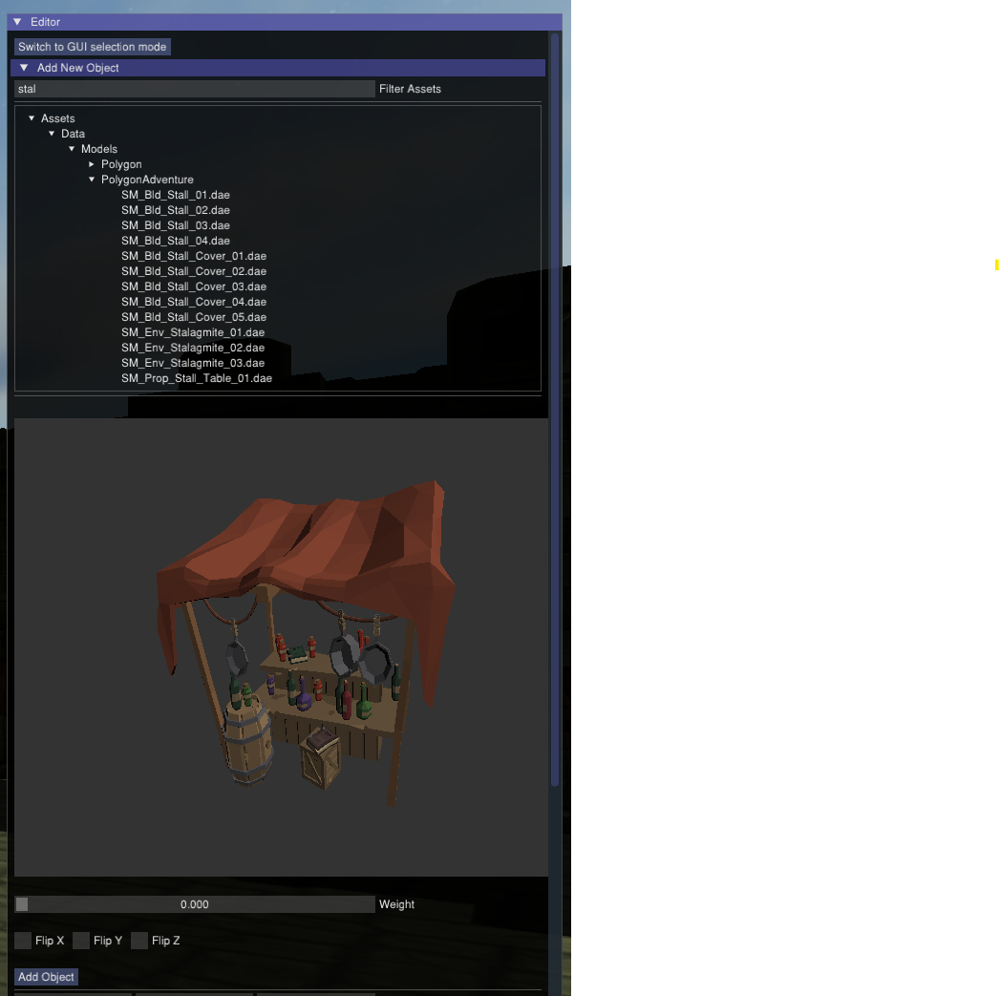

.. _AssetManagement:

================
Asset Management
================

The asset manager handles loading, processing, and lifetime management of all engine assets. It operates at the process level - assets are shared across all worlds, so the same resource is never loaded twice.

Asset Types
===========

.. list-table::
   :header-rows: 1
   :widths: 20 20 60

   * - Type
     - Source library
     - Notes
   * - Models (raw)
     - Assimp
     - 60+ formats supported. Used during development.
   * - Models (limonmodel)
     - Native
     - Engine-native format. Used for release builds. See `limonmodel`_ below.
   * - Animations
     - Assimp
     - Mixamo retargeting supported.
   * - Textures
     - SDL3_image
     - All formats supported by SDL3_image.
   * - Audio
     - OpenAL
     - WAV only.
   * - Materials (MaterialAsset)
     - Model asset or world file
     - Deduplicated automatically regardless of source. See `Materials as Assets`_ below.
   * - Shaders
     - GLSL
     - Discovered at launch via runtime reflection.

Loading Pipeline
================

Asset loading is split into two layers to maximise parallelism while keeping GPU uploads on the main thread:

* **CPU layer** - a thread pool decompresses, parses, and converts assets in parallel. Each completed asset is pushed to a thread-safe queue.
* **GPU layer** - the main thread consumes from the queue and does the GPU uploads.

A world signals ready only after all assets have completed both layers - no partial asset state is visible to the scene. In the editor, a model can only be placed after its loading is fully complete.

.. _AssetManagement-failures:

When Loading Fails
==================

Loading calls don't return an error. Failures are written to standard error, and whether the engine keeps running depends on what failed:

.. note::
    Failing hard is deliberate. Falling back to something that looks plausible turns a missing asset into a problem that shows up somewhere else, much later, and takes far longer to identify and fix than an engine that stops at the file it could not load.

    Textures are the one exception, because it is not the content's fault: many model formats store the texture paths from the machine the asset was made on, which never match the paths on the user's machine. The search by file name recovers those without the artist editing every model.

.. list-table::
   :header-rows: 1
   :widths: 35 65

   * - Failure
     - What happens
   * - Texture file missing or unreadable
     - The engine looks through the known assets under ``./Data`` for a file with the same name, then for the same name with any image extension, and uses the first one that loads. If none does, it logs ``TextureAsset Load from disk failed`` and uses ``./Engine/Textures/notFoundFallback.jpg``. The world keeps loading. If the fallback itself is missing, the engine exits.
   * - Texture referenced by a model
     - Found and resolved the same way, so a model whose textures were moved still loads, with the fallback texture if nothing matches. A texture slot the model file can't describe at all is left empty, with a log message.
   * - Model can't be imported, has no meshes, or has a material without a name
     - The engine exits, after an ``ERROR::ASSIMP`` or similar message.
   * - Sound file can't be read
     - The engine exits.
   * - World file missing or not valid XML
     - The engine exits.
   * - World file with invalid content (a required element missing, invalid IDs)
     - The engine exits, both at startup and when switching worlds during play.

The exits apply to API calls too: ``addObject``, ``playSound`` and ``setMusic`` take a path and don't check it first, so a wrong path stops the engine. Check the paths your extensions use during development.

World changes requested through the API (``loadAndSwitchWorld`` and the related calls) are queued and carried out after the current tick, so the call returns ``true`` as soon as the request is queued. If the load then fails, the engine exits.

Reference Counting
==================

* Objects hold read-only references to managed assets - no object owns an asset outright.
* Reference counting releases assets automatically when no world holds a reference.
* Assets shared between worlds are not reloaded during world transitions and are not double-counted by the reference system.

Materials as Assets
===================

All materials are managed as ``MaterialAsset`` objects regardless of origin. A material embedded in a model file and a material defined in the world file are both ``MaterialAsset`` instances - the asset manager makes no distinction between them.

If two models reference the same source material, it is loaded once and shared. Custom materials created or modified in the editor are saved in the world file and loaded identically to model-sourced materials.

For how to create and edit materials in the editor, see :ref:`UsingBuiltinEditor`.

World Transitions
=================

Four API methods control how the asset manager handles memory when switching worlds. The choice trades memory footprint against load time:

.. list-table::
   :header-rows: 1
   :widths: 24 12 13 51

   * - Method
     - Memory
     - Load time
     - Description
   * - ``loadAndSwitchWorld``
     - Higher
     - Shorter
     - New world loads while old stays in memory. Assets shared between both worlds are not reloaded. (:ref:`C++ <LimonAPI-loadAndSwitchWorld>` | :ref:`Python <pythonApi-load_and_switch_world>`)
   * - ``returnToWorld``
     - Higher
     - Shorter
     - Returns to a previously loaded world still in memory. (:ref:`C++ <LimonAPI-returnToWorld>` | :ref:`Python <pythonApi-return_to_world>`)
   * - ``loadAndRemove``
     - Lower
     - Longer
     - Releases old world and its exclusive assets before loading the new world. (:ref:`C++ <LimonAPI-loadAndRemove>` | :ref:`Python <pythonApi-load_and_remove>`)
   * - ``returnPreviousWorld``
     - Lower
     - Longer
     - Returns to the previous world after releasing the current one. (:ref:`C++ <LimonAPI-returnPreviousWorld>` | :ref:`Python <pythonApi-return_previous_world>`)

:ref:`quitGame <LimonAPI-quitGame>` / :ref:`quit_game <pythonApi-quit_game>` exits the application.

.. _limonmodel:

limonmodel - Engine-Native Format
==================================

Raw model formats (FBX, OBJ, GLTF, etc.) are suitable for development but carry redistribution restrictions and parse overhead. The ``limonmodel`` format is optimised for release:

* Near memory-direct layout - loading is read-and-map rather than parse-and-transform.
* Contains: vertex and index buffers, skeletal animation data, material information, and textures if they were embedded in the source file.
* Texture handling mirrors the source - embedded textures stay embedded; external texture references stay external.
* Faster load times and smaller file size than raw formats.
* Works around raw asset redistribution restrictions.

To convert all models in a world, use the **Convert models to binary** button in the world editor. The world file is updated to reference the converted assets automatically.

Asset Browser
=============

The editor includes an asset browser organised as a typed directory tree. Different editor panels use type-filtered views of the same browser.

* **Model assets** - a dedicated preview renders the model using the current world's directional light.
* **Texture assets** - a hover preview appears under the cursor. Shared by material texture slots, skybox settings, and GUI image and button elements.

    The asset browser with directory tree and 3D model preview.

Model Scaling
=============

The engine assumes 1 unit = 1 meter. If the source model has a unit defined (e.g. centimetres, inches), that unit is used to calculate the import scale automatically. If the source model has no unit defined, or an incorrect one, the model imports at the scale the file specifies. Scale can be corrected at any time in the editor. No heuristic-based correction is applied.
