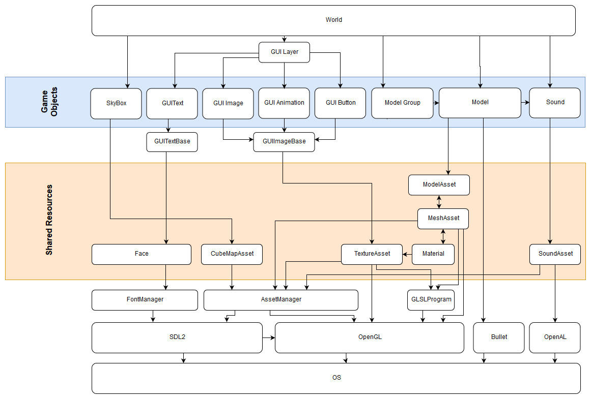

.. _EngineArchitecture:

===================
Engine Architecture
===================

.. note::
    This page is a work in progress. If you have any issues or questions, please open a ticket on GitHub.

Limon is a multi-platform, multi-threaded 3D game engine. Engine is built as a monolith, and architecture is not meant to be pluggable. It doesn't mean there is no extension points. The possible extension methods can be separated by 3 groups:

#. Dynamic Linking Extensions: Those are intended for game developers to use. Version 0.6 has 3 extension types:

    * Actions: These are attached to Trigger volumes, buttons or run on map load. Details can be found at :ref:`implementAction`
    * Player extensions: They attach to player, and get all inputs, as well as any requests to player interaction. :ref:`implementPlayerExtension` has the details.
    * AI actors: They attach to Models, and add agency to them. Details are at :ref:`implementAIActor`

#. Not Exposed Extensions: Those are extensions used by Engine developers.
    * Player interface for camera and movement (ex: 3rd person support)
    * GUIObject for GUI elements (ex: Video player)

#. Backend wrappers: Both rendering, sound, and platform(windowing, threading IO) are wrapped to their respective classes. Those are not intended to be extended by users, but engine developers. For example it should be rather easy to add a Vulkan backend for rendering.
    * Rendering: OpenGL
    * Audio: OpenAL
    * Platform: SDL2

.. note::
    Even though SDL2 and OpenAL are wrapped, multiple platform or sound backends not envisioned.

Engine Overview
===============

Subsystems
==========

Rendering
*********

For rendering graphics, Limon uses a custom multi pass forward renderer, built using OpenGL.

All renderable objects are child of class *Renderable*. *World* class flags *Renderable* instances with visibility for camera and lights in simulate step.

There is a *PhysicalRenderable* child class, that is attached to the physics subsystem. Those which are child of it are also considered shadow casters, and they have *void renderWithProgram(GLSLProgram &program)* method that allows custom shaders to be used for rendering. Those objects are also batched based on their materials, and instanced rendering is used for batches, if the object is not animated. Per object world transform matrices are held in a array, and uploaded to GPU. For rendering, another array with indexes of world transforms is created and used to render the objects.

Each renderable implements *void render()* method. *World* class sets the render target, resolution etc. for shadow map generation. After that, for each light, all visible flagged *PhysicalRenderable* instances will be rendered using either *void renderWithProgram(GLSLProgram &program)* or *void renderWithProgramInstanced(std::vector<uint32_t> &modelIndices, GLSLProgram &program)* for instanced rendering. When the shadow maps for all the lights are ready, normal rendering will be done again using visiblity flags.

Physics
*******

For physics Limon uses Bullet Physics. The only *PhysicalObject* children are registered to physics subsystem. At version 0.6, there are *Model* and *ModelGroup* classes that use Physics. The physical representation of Models are auto generated using the following logic:

#. For each mesh, if another mesh with same name prefixed with "UCX_" that mesh will be used.
#. Else if object is not animated, and static, use the full mesh data to generate rigid body. This is because static objects might be concave.
#. Else if object is not animated, and dynamic, auto generate a hull that encapsulates whole object. Dynamic objects are forced to be convex.
#. Else if object is animated, for each bone, auto generate a hull for the vertices that are attached to that bone. Each of those hulls animate with the object itself

Model groups just groups the models with given physical representations.

IO
**

IO is handled with multiple levels of abstraction. Part of platform wrapper maps raw input to engine inputs. After that, an implementer of *Player* will get the input in form of *void move(moveDirections)* and *void rotate(float xPosition, float yPosition, float xChange, float yChange)* methods. The Player class has settings that allow different types of interaction, like physical, editor etc. In the end, the inputs are feed to PlayerExtensions, so they can handle them as they see fit.

Sound
*****

Sound backend is OpenAL. A separate thread is used to refresh sound buffers. Sound Assets and sound subsystem complexities are abstracted by Sound GameObject.

GUI
***

GUI is rendered and IO is handled by normal subsystems. GUI objects must implement *GUIRenderable* class. If the current *Player* is flagged with *menuInteraction*, the GUI objects will react to player input.

Editor
******

Editor is built using Dear ImGui library. Main part of it is within *World* class, but to enable custom behaviour, objects get to implement their own editor interfaces.

Game Play and Game Objects
**************************

As of version 0.6, Limon engine has following game objects:

* Player
* Light
* Model
* Model Group
* SkyBox
* Trigger Object
* Gui Text
* Gui Image
* Gui Button
* Gui Animation
* Sound

Those object can be used in Editor, and by Triggers. Gameplay layer has an API called LimonAPI, and it has an interface to allow extending, and Limon Engine supports dynamically loading those custom triggers. For details, please check :ref:`implementAction`

AI
**

Limon has an interface called *ActorInterface* that is used to allow custom AI implementations to be used. Each actor will be triggered each simulation step with *ActorInformation*, which contains the player direction, whether or not player is visible etc. It is possible to ask for a route to player using this interface too, assuming actor is same size with the player.
