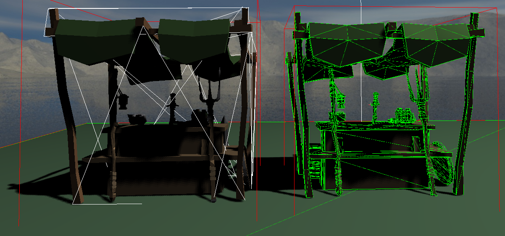
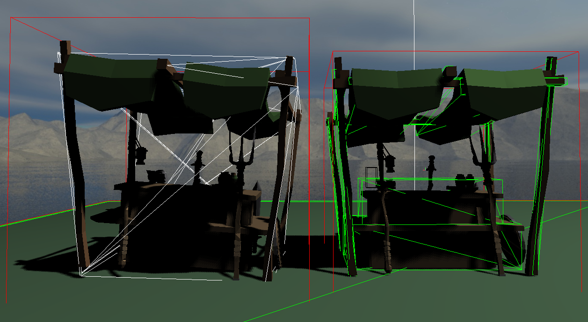
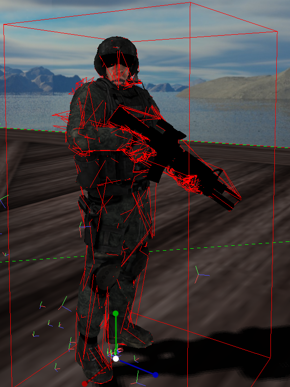

.. _EngineArchitecture:

===================
Engine Architecture
===================

Limon is a multi-platform, multi-threaded 3D game engine built as a deliberate monolith. The boundary between what game developers extend, what engine developers modify, and what backend implementers replace is explicit and stable.

The engine is optimised for integrated GPU hardware with dual-channel RAM -mainstream and budget hardware without a discrete GPU. This target directly shapes several architectural choices, particularly the CPU-side culling investment described in :ref:`RenderingPipeline`.

This engine uses traditional OOP like structure internally. ECS is quite popular around game engine enthusiasts, but it comes with real tradeoffs. First of all, it is harder to reason about, and harder do debug, as well as harder to develop, both on engine side, but also game side.
Games need many unique behaviours, one offs, and customizations. These are not the strong suite of ECS. The real win for it would be in numerous active entities, but modern games, with little exception, has very limited active entities, and this has been the trend for decades.
Since Limon is focusing on learning, both on the game design side, but also on the engine side, and we are not specifically targeting thousands of active entities, not using ECS is an intentional decision.

.. note::
    Any camera type is supported -first-person, third-person, top-down, orbital, isometric, or fixed camera, in both **perspective and orthographic** projection. Cameras are authored as :ref:`camera attachments <implementCameraAttachment>` (first-class ``CameraRig`` scene objects); the engine ships a first-person default plus perspective and orthographic attachment samples.

High-Level Structure
====================

The diagram below traces the engine class by class, the way the original 0.6 overview did, updated for 0.7. It is read top to bottom: a ``World`` owns the **game objects**; each game object references **shared resources** (reference-counted, deduplicated assets) rather than owning its data; ``AssetManager`` manages those assets; and the renderer resolves to a swappable graphics backend that, together with the platform-abstraction libraries, sits on the operating system. User extensions reach the engine only through the C++ or Python API.

.. only:: html

   .. figure:: _static/media/images/EngineArchitecture_0_7.svg
       :width: 100%
       :alt: Limon 0.7 engine class architecture

.. only:: not html

   .. figure:: _static/media/images/EngineArchitecture_0_7.png
       :width: 100%
       :alt: Limon 0.7 engine class architecture

The bands read top to bottom, updating the original 0.6 overview for 0.7:

* **C++ API** -the five extension interfaces a C++ plugin implements (Action, AI Actor, Player Extension, Camera Attachment, RenderMethod), plus the ``LimonAPI`` / ``GenericParameter`` surface they call. Detailed under `Five User Extension Points`_.
* **Python API** -the four Python-capable interfaces (every gameplay extension) reach ``LimonAPI`` through ``pybind11`` and the per-world ``ScriptManager``. See :ref:`pythonApi`.
* **Game Objects** -what a ``World`` owns. 0.7 adds ``Light``, ``Trigger``, the CPU/GPU particle emitters, and ``Player`` to the original set; the full list and attachment rules are under `Game Object Types`_.
* **Shared Resources** -the reference-counted, deduplicated assets game objects point into instead of owning. A ``ModelAsset`` (imported via ``Assimp``) references its ``MeshAsset``, a ``MaterialAsset`` (which holds the ``TextureAsset`` set, also sourced from the import), and an ``AnimationAsset``. The shader ``GraphicsProgramAsset`` (replacing 0.6's ``GLSLProgram``) is bound by the renderer, not the mesh. Lifetime and loading: :ref:`AssetManagement`.
* **Rendering** -``GraphicsPipeline`` drives ``VisibilityManager``, which fills a ``RenderList`` of survivors; ``RenderMethods`` then consume that ``RenderList`` and draw, binding ``GraphicsProgramAsset`` and issuing the calls through the abstract ``GraphicsInterface``. Full detail: :ref:`RenderingPipeline`.
* **Managers** -``AssetManager`` manages every asset type. Most assets register with it directly; font textures are the exception - ``FontManager`` owns the per-``Face`` set of font ``TextureAsset``\ s and is itself managed by ``AssetManager``, so those are managed indirectly.
* **Profiling and Debug** -cross-cutting instrumentation that ``World``, both APIs, and the render pipeline feed: Tracy / ``ProfilerSystem`` and the ``BulletDebugDrawer``.
* **Graphics Backend** -``GraphicsInterface`` resolves to a swappable ``GraphicsBackends`` dynamic library (OpenGL 3.3 or OpenGL ES 3.1 - see `Platform Support`_), so the backend changes without touching engine code.
* **Platform Abstraction Layer** -only ``SDL2`` (windowing, input, image loading) and ``OpenAL`` (audio) abstract the operating system directly. The other third-party libraries are wired where they are used rather than as an OS layer: ``Freetype`` rasterises font faces, ``Assimp`` imports models and materials, and ``Bullet`` runs physics for ``Model``, ``Player``, and ``Trigger``. Full list: `Third-Party Libraries`_.

Target Hardware
===============

.. list-table::
   :header-rows: 1
   :widths: 10 22 25 14 14 15

   * - Release
     - CPU
     - GPU
     - RAM
     - Resolution
     - Target framerate
   * - **0.6**
     - Pentium G4560
     - Intel HD 610 (iGPU)
     - Dual channel
     - 720p
     - 30 fps
   * - **0.7**
     - Intel Core i5-8400
     - Intel UHD 630 (iGPU)
     - Dual channel
     - 1080p
     - 60 fps (Low)

Extension Layers
================

Three development roles have distinct extension boundaries:

* **User layer** -Five extension points, all implemented in a single user dynamic library (DLL on Windows, SO on Linux/macOS). The library is scanned at engine launch.
* **Engine developer layer** -Camera movement and GUI object implementations. C++ only, not intended for external extension.
* **Backend layer** -The graphics backend is a public interface loadable as a dynamic library. Ships with OpenGL 3.3 and OpenGL ES 3.1. Custom backends (Vulkan, Metal, DirectX) are possible without modifying engine source. Audio and platform abstraction are wrapped similarly but not intended for external extension.

Five User Extension Points
--------------------------

All five types are scanned from the same user dynamic library at engine launch.

.. list-table::
   :header-rows: 1
   :widths: 30 70

   * - Extension Type
     - Interface Contract
   * - **Action**
     - Fires on spatial interaction, GUI button press, or map load.
       See :ref:`implementAction`.
   * - **Player Extension**
     - Per-frame player input and transform control.
       See :ref:`implementPlayerExtension`.
   * - **AI Actor**
     - Per-simulation-step AI callbacks with pathfinding access.
       See :ref:`implementAIActor`.
   * - **Camera Attachment**
     - Per-frame camera control -returns the camera pose each frame and
       declares its projection (perspective or orthographic). A registered,
       configurable extension that the engine wraps in a ``CameraRig`` scene
       object. See :ref:`implementCameraAttachment`.
   * - **RenderMethod**
     - Custom GPU rendering primitive -wired in the pipeline editor.
       See :ref:`RenderingPipeline`.

GenericParameter -Universal Data Contract
==========================================

``LimonTypes::GenericParameter`` is the single data type flowing through every layer of the engine. It is the canonical representation of any named, typed value shared between the editor, C++ extensions, Python scripts, AI actors, trigger results, and RenderMethod configuration. One struct covers three concerns for an extension at once - **load** from disk, **serialize** to disk, and **edit** in the editor - so an extension describes its parameters once and gets all three. The editor automatically generates the appropriate ImGui widget for each parameter type -no separate editor code is required for any extension.

All five extension points -Actions, Player Extensions, AI Actors, Camera Attachments, and RenderMethods -expose their configuration through this contract via ``getParameters()`` / ``setParameters()``.

**RequestParameterType** -controls which editor widget is rendered:

    ``MODEL``, ``ANIMATION``, ``SWITCH``, ``FREE_TEXT``, ``TRIGGER``, ``GUI_TEXT``, ``FREE_NUMBER``, ``COORDINATE``, ``TRANSFORM``, ``MULTI_SELECT``

**ValueType** -describes the stored value:

    ``STRING``, ``DOUBLE``, ``LONG``, ``LONG_ARRAY``, ``FLOAT_ARRAY``, ``BOOLEAN``, ``VEC4``, ``MAT4``

For full documentation of GenericParameter usage in extensions, see :ref:`CPPAPIUsage`.

Game Object Types
=================

Every entity in a Limon world is a ``GameObject``. All types implement the base class virtual interface, including ``addImGuiEditorElements`` for their own editor UI.

.. list-table::
   :header-rows: 1
   :widths: 20 80

   * - Type
     - Description
   * - **Model**
     - Static or animated mesh. Can carry an attachment tree directly or via a named bone.
   * - **Model Group**
     - Collection of models managed as a unit.
   * - **Player**
     - Player controller. Has one model attachment point.
   * - **GUI Text**
     - Text display element -animatable via sequencer.
   * - **GUI Button**
     - Wraps a LimonAPI call, executes it on player interaction.
   * - **GUI Image**
     - Image display element -animatable via sequencer.
   * - **CPU Particle**
     - CPU-side particle emitter.
   * - **GPU Particle**
     - GPU-side particle emitter.
   * - **Light**
     - Directional or point light. Creatable and removable at runtime.
   * - **Skybox**
     - Environment backdrop.
   * - **Trigger Volume**
     - Spatial volume with attached Actions.

Object Attachment
-----------------

Models carry attachment trees. The following types can attach to a model root or to a specific named bone. Bone attachment means the child follows the bone transform through the full skeletal animation:

* **Model** -can itself carry further attachments, forming a full tree
* **Model Group**
* **Trigger Volume** -moves with the parent model or bone
* **CPU Particle** -e.g. attach to a foot bone for ground dust
* **GPU Particle**
* **Light** -e.g. attach to a hand bone for a held torch

The Player has one model attachment point. The attached model is the root of a normal attachment tree -it can carry further models, particles, lights, and triggers.

GUI elements and Skybox cannot be attached as children.

For asset loading, lifetime management, world transitions, and the limonmodel format see :ref:`AssetManagement`.

Subsystems
==========

Rendering
---------

The rendering subsystem uses a custom pipeline with a swappable graphics backend. Forward and deferred pipeline configurations ship with the engine. Custom pipelines are built using the visual pipeline editor without modifying engine source. Full details: :ref:`RenderingPipeline`.

Physics
-------

Limon uses Bullet Physics. Collision shapes are generated automatically from mesh data:

#. For each mesh, if another mesh with the same name prefixed with ``UCX_`` exists, that mesh is used as the collision shape.
#. Else if the object is static, the full mesh data is used (supports concave geometry).
#. Else if the object is dynamic, an auto-generated convex hull is used.
#. Else if the object is animated, a convex hull per bone is generated for the vertices attached to each bone.

    Dynamic objects have convex hulls (left), static objects use full mesh collision (right).

    Static objects can use baked ``UCX_`` collision meshes (right).

    Animated objects have per-bone convex hulls.

Input
-----

Input is handled by SDL2. The full SDL2 input event stream is passed to Player Extensions each frame. Controllers, joysticks, and other SDL2-supported devices are handleable via Player Extension.

Sound
-----

Audio backend is OpenAL. A separate thread refreshes sound buffers. Supported formats: OGG and WAV.

GUI
---

GUI objects must belong to a layer. Layer ordering controls draw order. Interactive GUI is active when the player is in menu mode. GUI elements are creatable, movable, and removable at runtime via API.

Editor
------

The editor runs inside the game process. There is no separate edit mode or play mode -changes apply to the next frame in a live world. Built with Dear ImGui. Each ``GameObject`` type implements its own editor UI via ``addImGuiEditorElements`` -no central editor registry.

AI
--

Limon builds a 3D navigation grid per world, flood-filled from the first AI actor location. AI actors implement ``ActorInterface``, called each simulation step with ``ActorInformation``: player direction, line-of-sight state, distance, and pathfinding results. Route requests are asynchronous -the simulation tick is never blocked. For extension details: :ref:`implementAIActor`.

Platform Support
================

The same engine binary selects its graphics backend at launch from a dynamic library -OpenGL 3.3 or OpenGL ES 3.1.

.. list-table::
   :header-rows: 1
   :widths: 22 15 18 45

   * - Platform
     - Arch.
     - Backend
     - Notes
   * - **Linux**
     - x86
     - OpenGL 3.3
     - Primary development platform
   * - **Windows**
     - x86
     - OpenGL 3.3
     - MSYS2 / CMake build
   * - **macOS**
     - AArch64
     - OpenGL 3.3
     - Apple Silicon -NEON occlusion backend
   * - **Raspberry Pi 4/5**
     - AArch64
     - OpenGL ES 3.1
     - NEON occlusion backend. Known Mesa driver issue -ticket open.

Build requirements and platform-specific instructions: :ref:`GettingStarted`.

Third-Party Libraries
=====================

.. list-table::
   :header-rows: 1
   :widths: 25 75

   * - Library
     - Purpose
   * - Bullet Physics
     - Rigid body physics simulation
   * - OpenAL
     - Audio backend
   * - Dear ImGui
     - Editor UI
   * - pybind11
     - Python scripting bridge
   * - Assimp
     - Asset import (models, animations)
   * - meshoptimizer
     - Automatic LOD mesh generation
   * - SDL2
     - Platform abstraction, input, windowing
   * - SDL2_image
     - Texture loading
   * - CityHash
     - String interning
   * - Tracy
     - CPU and GPU profiling
