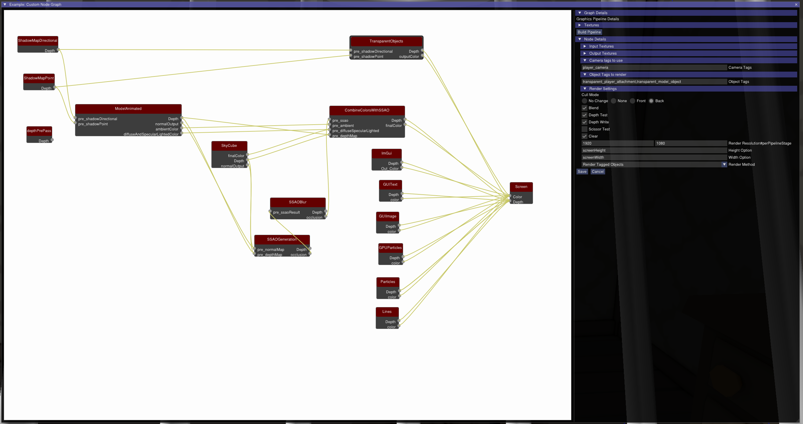
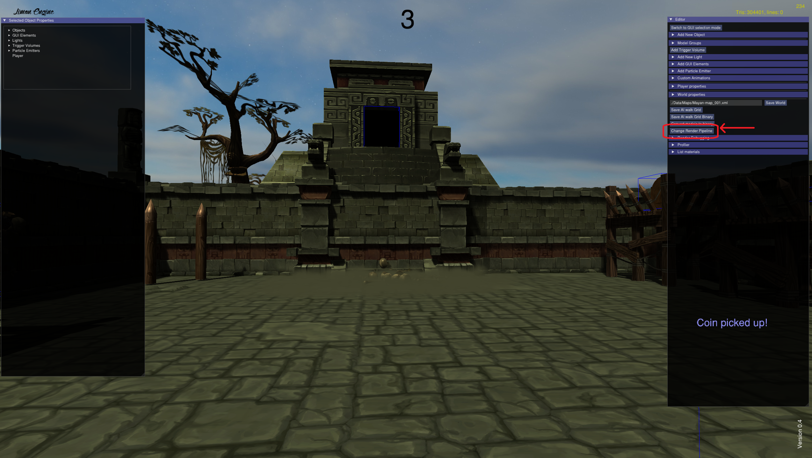
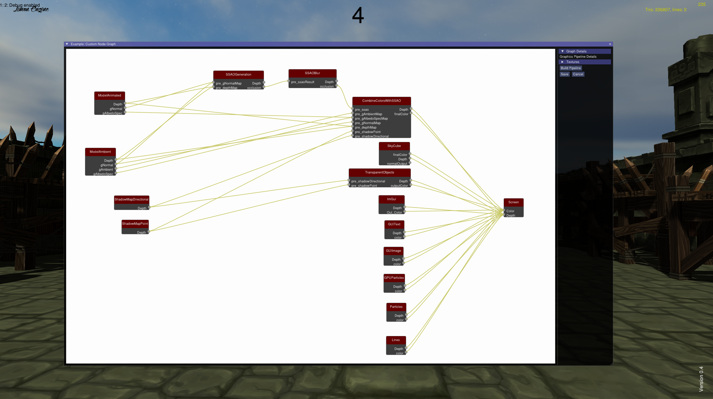

.. _RenderingPipeline:

==================
Rendering Pipeline
==================

The rendering pipeline in Limon is fully configurable through a node-based visual editor. The engine ships with forward and deferred pipeline configurations, but any custom pipeline can be built and loaded at runtime without modifying engine source.

Three types of developer benefit from this system:

* **Optimisation-focused** -improve performance by adjusting pass ordering, culling parameters, and LOD settings without touching engine code.
* **Custom rendering** -add post-processing effects, custom shaders, or a completely different shading model, with real-time preview in the editor.
* **Learning** -isolate individual rendering stages to experiment with GPU programming in a live scene.

The author switched the engine to deferred rendering in under a day using this system.

Pipeline Editor
===============

The pipeline editor is accessible from within the editor UI. Every available GLSL shader program is discovered automatically via runtime reflection and appears as a node type. Nodes are wired together to define how GPU resources flow between passes. The compiled pipeline is a runtime object executed every frame -the visual graph and the runtime object are always consistent.

    The pipeline node editor with shader nodes wired together.

    Opening the pipeline editor from within the editor UI.

Nodes and Wiring
----------------

Each node represents a rendering pass. Inputs and outputs on each node are discovered automatically from the shader source via reflection -no manual registration required. Outputs from one node connect to inputs of another to define GPU resource flow.

The **Screen node** is the terminal -the final colour output must be wired to it.

Each node has two configuration fields beyond wiring:

* **RenderMethod** -selects which RenderMethod renders geometry through this shader pass. See `RenderMethod Extension Point`_ below.
* **Camera name** -names which camera's culling results this pass uses. Multiple cameras with independent culling results are supported.

The pipeline editor performs **automatic stage reordering** at compile time -passes are ordered for correctness based on their dependency graph.

Built-in Pipeline Configurations
---------------------------------

Two configurations ship with the engine:

* **Forward** -single-pass geometry rendering with direct lighting. Lower memory usage.
* **Deferred** -geometry and lighting decoupled across passes. Scales better with many lights.

A custom pipeline can be loaded at runtime from a file (:ref:`C++ <LimonAPI-changeRenderPipeline>` | :ref:`Python <pythonApi-change_render_pipeline>`)::

    changeRenderPipeline(pipelineFileName)

    The deferred pipeline with all nodes and wiring visible.

Filtering Pipeline
==================

Each rendering pass applies four sequential visibility filters. With multiple cameras in the pipeline (player camera, shadow map cameras), each camera runs its culling workload on a separate thread concurrently.

1. **Tag filtering** -each camera and each scene object carries a tag. The pass specifies which camera tags render which object tags. Tags are converted to uint128 hashes at pipeline load for zero-cost matching at runtime.

2. **Frustum culling** -objects outside the camera's view volume are discarded. Point lights use sphere-based culling rather than frustum culling -a point light illuminates in all directions, and a frustum test would incorrectly cull lights behind the camera that still illuminate visible geometry.

3. **Occlusion culling** -a SIMD software depth buffer on the CPU. Objects above a configurable size threshold act as occluders; smaller objects are tested against the depth buffer. See `SIMD Software Occlusion Culling`_ below.

4. **LOD selection** -the appropriate level-of-detail mesh is selected based on the object's projected screen-space size and the engine-wide LOD settings.

Tagging
-------

The engine automatically tags objects: ``animated``, ``static``, ``transparent``, and others. Tags are freely changeable in the editor. Custom pipeline configurations target specific tags -enabling per-tag custom shaders or custom passes for specific object categories.

Built-in Shaders
================

The following shader programs ship with the engine and appear as node types in the pipeline editor. Custom shaders placed in the shader directory are discovered automatically via the same reflection.

.. list-table::
   :header-rows: 1
   :widths: 35 65

   * - Shader
     - Description
   * - **Directional shadow map generation**
     - Cascaded shadow map generation for directional lights.
   * - **Point shadow map generation**
     - Cube map shadow generation for point lights.
   * - **Static model**
     - Standard mesh render pass.
   * - **GPU skinning model**
     - Skeletal mesh render pass with GPU-side skinning.
   * - **Transparent model pass**
     - Alpha-blended geometry pass.
   * - **SSAO generation**
     - Screen-space ambient occlusion -implemented as a sample custom RenderMethod.
   * - **SSAO blur**
     - Depth-aware blur for SSAO output.
   * - **Combine shading**
     - Composites lighting contributions across passes.
   * - **GUI**
     - Renders GUI elements.
   * - **Editor**
     - Renders editor overlays.
   * - **Sky**
     - Skybox render pass.

RenderMethod Extension Point
============================

RenderMethod is the fifth user-layer extension point. It is a custom GPU rendering primitive instantiated and wired in the pipeline editor. Like all five extension types, it is scanned from the user dynamic library at engine launch.

.. list-table::
   :header-rows: 1
   :widths: 20 80

   * - Method
     - Description
   * - ``getName``
     - Returns the method name for the editor dropdown.
   * - ``initMethod``
     - Called at pipeline load. Receives a GenericParameter list for configuration.
   * - ``renderFrame``
     - Called each frame. Receives the graphics interface pointer and GPU program pointer.
   * - ``clearMethod``
     - Tears down GPU resources on pipeline unload or reconfiguration.

GenericParameter fields declared in the RenderMethod constructor automatically appear as editable fields on the shader node in the pipeline editor -no separate editor code required.

Two built-in RenderMethods ship with the engine:

* **Render By Tag** -the primary RenderMethod for all 3D geometry. Uses a named camera's culling results and a tag filter. Used by static model, GPU skinning model, and transparent pass nodes.
* **Quad Renderer** -convenience RenderMethod for post-processing passes. Full-screen quad, no geometry iteration.

**SSAO ships as a sample RenderMethod**, demonstrating GenericParameter configuration (sample count) and full-screen post-processing. It is a good starting point for custom effects.

Materials and the Pipeline
==========================

All materials are uploaded to the GPU as a Uniform Buffer Object (UBO). A material index is passed per instance as part of instanced rendering data. Any shader that declares the material UBO is automatically detected via reflection - no registration required. Custom pipeline shaders receive the full material array by declaring the UBO.

For how materials are created, edited, and managed see :ref:`UsingBuiltinEditor` and :ref:`AssetManagement`.

Performance Systems
===================

Targeting integrated GPU hardware motivates a significant CPU-side visibility investment. Draw call overhead is more expensive on iGPU than on discrete GPU -reducing the objects submitted for rendering produces a larger framerate gain than the same reduction would on dedicated hardware. All culling systems run multithreaded, with each camera's workload on a separate thread.

SIMD Software Occlusion Culling
--------------------------------

A software depth buffer produces per-camera visibility results consumed by Render By Tag passes.

* Depth buffer based, AABB occludee testing
* Default resolution 512x256 -must be a multiple of 8 for SIMD alignment, configurable
* SSE4.1 on x86, NEON on AArch64 -covers Apple Silicon and Raspberry Pi 4/5
* A debug AABB wireframe picture-in-picture overlay is available in the editor

Level of Detail
---------------

LOD mesh generation is automatic via meshoptimizer. Every model gets 4 LOD levels: 3 progressive simplifications plus the original mesh.

* LOD selection is engine-wide -not configurable per model
* Aggressive LOD settings can produce visible pop-in -tune the LOD option for your scene

Size-Based Render Skipping
--------------------------

Objects below a projected screen-space size threshold are skipped entirely -not submitted for rendering. This is a binary skip, independent from LOD. The threshold is an engine-wide option.

Lighting
--------

* Directional light with cascaded shadow maps. Each cascade uses a tight-fitting, texel-snapped orthographic view derived from the player view frustum and the ``CascadeLimitList`` boundaries -no manual projection extents required. ``lightOrthogonalProjectionBackOff`` controls how far behind the camera the light origin is pulled to capture shadow casters behind the player. Staggered cascade rendering is optional (~10% performance gain).
* Point lights with cube map shadow casting.
* Ambient lighting.
* Lights are creatable and removable at runtime via :ref:`addLight <LimonAPI-addLight>` / :ref:`removeLight <LimonAPI-removeLight>` (:ref:`Python: add_light <pythonApi-add_light>` / :ref:`remove_light <pythonApi-remove_light>`).
* No global illumination -direct lighting with shadow maps only.

Configuration Reference
=======================

All options live in ``./Engine/Options.xml``. The file is read at launch; restart the engine after editing.

Display
-------

.. list-table::
   :header-rows: 1
   :widths: 28 12 15 45

   * - Option
     - Type
     - Default
     - Description
   * - ``screenWidth``
     - Long
     - 2560
     - Render width in pixels.
   * - ``screenHeight``
     - Long
     - 1440
     - Render height in pixels.
   * - ``fullScreen``
     - Bool
     - False
     - Run in fullscreen mode.
   * - ``TextureFiltering``
     - String
     - Trilinear
     - Texture filtering mode. Values: ``Nearest``, ``Bilinear``, ``Trilinear``.

Rendering Pipeline
------------------

.. list-table::
   :header-rows: 1
   :widths: 30 12 30 28

   * - Option
     - Type
     - Default
     - Description
   * - ``GraphicsBackend``
     - String
     - libOpenGLGraphicsBackend
     - Dynamic library name for the graphics backend. Change to swap OpenGL 3.3 for OpenGL ES 3.1 or a custom backend.
   * - ``StartingRenderPipeline``
     - String
     - ./Engine/forward_+renderPipeline.xml
     - Pipeline configuration file to load at launch.
   * - ``renderInformations``
     - Bool
     - True
     - Show render stats overlay.

Shadows
-------

.. list-table::
   :header-rows: 1
   :widths: 36 13 16 35

   * - Option
     - Type
     - Default
     - Description
   * - ``shadowMapDirectionalSize``
     - Long
     - 2048
     - Directional shadow map resolution (square).
   * - ``shadowMapPointWidth``
     - Long
     - 512
     - Point light shadow cube map width.
   * - ``shadowMapPointHeight``
     - Long
     - 512
     - Point light shadow cube map height.
   * - ``DirectionalShadowSampleCount``
     - Long
     - 8
     - PCF sample count for directional shadows.
   * - ``PointShadowSampleCount``
     - Long
     - 20
     - PCF sample count for point light shadows.
   * - ``CascadeCount``
     - Long
     - 4
     - Number of shadow cascade splits.
   * - ``CascadeLimitList``
     - FloatArray
     - 5, 20, 50, 150, 250
     - World-space distances for each cascade boundary.
   * - ``CascadeStaggerIntervals``
     - LongArray
     - 4, 2, 4, 8
     - Frames between updates for each cascade (cascade 0 always updates). Higher values improve performance but delay shadow response.
   * - ``CascadeStaggerOffsets``
     - LongArray
     - 4, 1, 2, 4
     - Frame offset for each cascade's update schedule. Distributes load to avoid per-frame spikes.
   * - ``lightOrthogonalProjectionBackOff``
     - Double
     - -5000
     - How far behind the player frustum the directional light's view origin is pulled. Increase to capture shadow casters behind the camera.
   * - ``lightPerspectiveProjectionNearPlane``
     - Double
     - 1.0
     - Near plane for point light perspective projection.
   * - ``lightPerspectiveProjectionFarPlane``
     - Double
     - 100
     - Far plane for point light perspective projection.

SSAO
----

.. list-table::
   :header-rows: 1
   :widths: 28 12 15 45

   * - Option
     - Type
     - Default
     - Description
   * - ``SSAOEnabled``
     - Bool
     - True
     - Enable screen-space ambient occlusion.
   * - ``SSAOWidth``
     - Long
     - 2560
     - SSAO render buffer width.
   * - ``SSAOHeight``
     - Long
     - 1440
     - SSAO render buffer height.
   * - ``SSAOSampleCount``
     - Long
     - 9
     - Number of SSAO samples per pixel.
   * - ``SSAOBlurRadius``
     - Long
     - 1
     - Blur radius applied to the SSAO output.

Culling and LOD
---------------

.. list-table::
   :header-rows: 1
   :widths: 34 13 14 39

   * - Option
     - Type
     - Default
     - Description
   * - ``multiThreadedCulling``
     - Bool
     - True
     - Run each camera's culling workload on a separate thread.
   * - ``LodDistanceList``
     - LongArray
     - 5, 10, 25, 150, 250
     - World-space distances at which the engine steps down to the next LOD level. Four values for four transitions between the original mesh and 3 simplification levels.
   * - ``SkipRenderDistance``
     - Double
     - 50.0
     - Minimum distance before size-based skipping applies. Objects closer than this are never skipped by size.
   * - ``SkipRenderSize``
     - Double
     - 0.075
     - On-screen size fraction below which a distant object is skipped entirely. 1.0 = full screen. Only applies beyond ``SkipRenderDistance``.
   * - ``MaxSkipRenderSize``
     - Double
     - 3.0
     - World-space size above which an object is never skipped regardless of distance. Prevents large geometry (ground, walls) from disappearing at range.
   * - ``SoftwareOcclusionOccluderSize``
     - Double
     - 0.5
     - On-screen size fraction above which an object contributes to the occlusion depth buffer. Objects below this are tested against the buffer instead. 1.0 = full screen, 0.0 = no coverage.
   * - ``SoftwareOcclusionRenderWidth``
     - Long
     - 512
     - Occlusion depth buffer width. Must be a multiple of 8.
   * - ``SoftwareOcclusionRenderHeight``
     - Long
     - 256
     - Occlusion depth buffer height. Must be a multiple of 8.
   * - ``SoftwareOcclusionRenderDump``
     - Bool
     - False
     - Dump the occlusion depth buffer to a PPM file. Debug use only.
   * - ``SoftwareOcclusionRenderDumpFrequency``
     - Long
     - 300
     - Frame interval between depth buffer dumps.
   * - ``SplitModelToMeshCount``
     - Long
     - 10
     - When a model has more meshes than this, occlusion tests run per mesh rather than per model.
   * - ``maximumLights``
     - Long
     - 4
     - Maximum number of simultaneously active lights. If there is a directional light, it is always active. The engine selects the most relevant point lights up to this limit.

Player
------

.. list-table::
   :header-rows: 1
   :widths: 28 12 15 45

   * - Option
     - Type
     - Default
     - Description
   * - ``walkSpeed``
     - Vec4
     - (8, 0, 8)
     - Per-axis walk speed (X, Y, Z).
   * - ``runSpeed``
     - Vec4
     - (12, 0, 12)
     - Per-axis run speed.
   * - ``moveSpeed``
     - Vec4
     - (8, 0, 8)
     - Per-axis movement speed used by Player Extension.
   * - ``freeMovementSpeed``
     - Vec4
     - (0.5, 0.5, 0.5)
     - Speed in editor free-camera mode.
   * - ``jumpFactor``
     - Double
     - 7.0
     - Jump impulse strength.
   * - ``lookAroundSpeed``
     - Double
     - -6.5
     - Mouse look sensitivity. Negative = standard axes.

Debug and Profiling
-------------------

.. list-table::
   :header-rows: 1
   :widths: 34 12 14 40

   * - Option
     - Type
     - Default
     - Description
   * - ``DebugDrawLines``
     - Bool
     - False
     - Enable the debug line draw system globally.
   * - ``debugDrawBufferSize``
     - Long
     - 1000
     - Maximum number of lines in a single debug buffer.
   * - ``Profiler.EnableServer``
     - Bool
     - True
     - Enable the embedded Tracy profiling server (flame graph visible in editor).

Further Reading
===============

* `New Render System -overview and motivation <https://limonengine.com/technical/2026/03/23/New-Render-System.html>`_
* `Render Pipeline How-To -filtering and culling internals <https://limonengine.com/technical/2026/03/24/Render-system-how-to.html>`_
