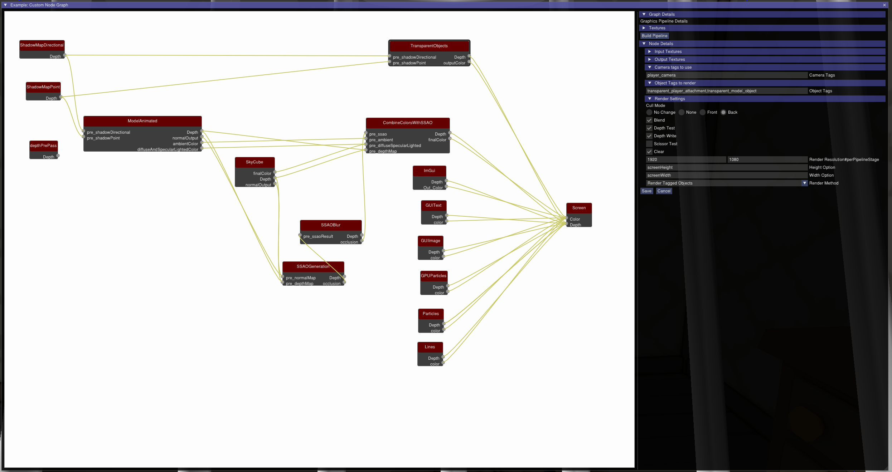
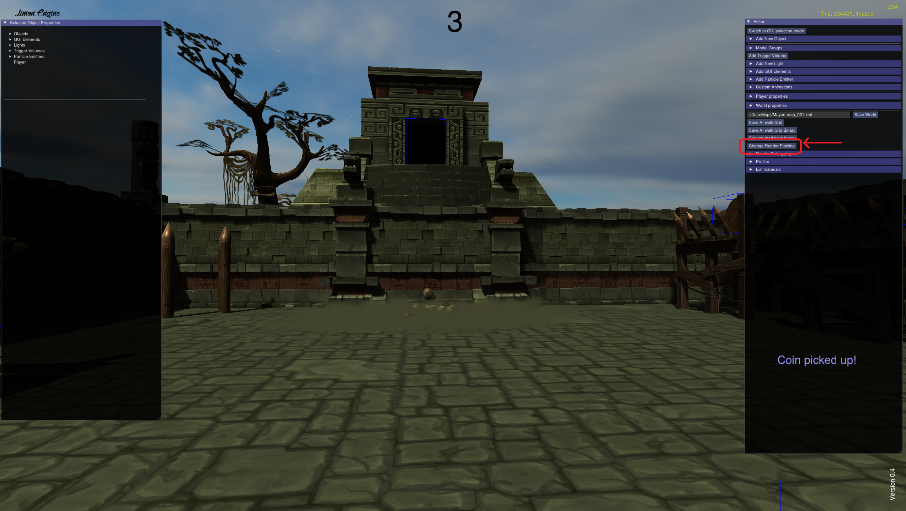
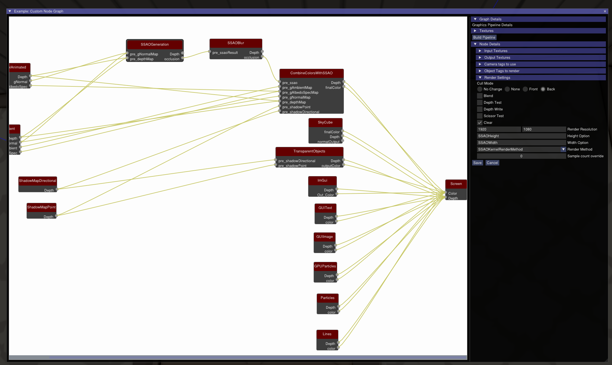
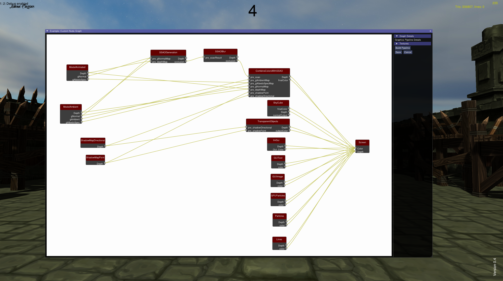

.. _RenderingPipeline:

==================
Rendering Pipeline
==================

The rendering pipeline in Limon is fully configurable through a node-based visual editor. The engine ships with forward and deferred pipeline configurations, but any custom pipeline can be built and loaded at runtime without modifying engine source.

Three types of developer benefit from this system:

* **Optimisation-focused** -improve performance by adjusting pass ordering, culling parameters, and LOD settings without touching engine code.
* **Custom rendering** -add post-processing effects, custom shaders, or a completely different shading model, with real-time preview in the editor.
* **Learning** -isolate individual rendering stages to experiment with GPU programming in a live scene.

The author switched the engine to deferred rendering in under a day using this system.

Pipeline Editor
===============

The pipeline editor is accessible from within the editor UI. Every available GLSL shader program is discovered automatically via runtime reflection and appears as a node type. Nodes are wired together to define how GPU resources flow between passes. The compiled pipeline is a runtime object executed every frame -the visual graph and the runtime object are always consistent.

    The pipeline node editor with shader nodes wired together.

    Opening the pipeline editor from within the editor UI.

    When the renderMethod has parameters to configure, they are exposed on the node.

Nodes and Wiring
----------------

Each node represents a rendering pass. Inputs and outputs on each node are discovered automatically from the shader source via reflection -no manual registration required. Outputs from one node connect to inputs of another to define GPU resource flow.

The **Screen node** is the terminal -the final colour output must be wired to it.

Each node has two configuration fields beyond wiring:

* **RenderMethod** -selects which RenderMethod renders geometry through this shader pass. See `RenderMethod Extension Point`_ below.
* **Camera name** -names which camera's culling results this pass uses. Multiple cameras with independent culling results are supported.

When the selected RenderMethod exposes configurable parameters, those parameter widgets appear on the node directly beneath the RenderMethod field. The values are saved with the node graph and the runtime pipeline -see `RenderMethod Extension Point`_ below.

The pipeline editor performs **automatic stage reordering** at compile time -passes are ordered for correctness based on their dependency graph.

Built-in Pipeline Configurations
---------------------------------

Two configurations ship with the engine:

* **Forward** -single-pass geometry rendering with direct lighting. Lower memory usage.
* **Deferred** -geometry and lighting decoupled across passes. Scales better with many lights.

A custom pipeline can be loaded at runtime from a file (:ref:`C++ <LimonAPI-changeRenderPipeline>` | :ref:`Python <pythonApi-change_render_pipeline>`)::

    changeRenderPipeline(pipelineFileName)

    The deferred pipeline with all nodes and wiring visible.

Filtering Pipeline
==================

Each rendering pass applies four sequential visibility filters. With multiple cameras in the pipeline (player camera, shadow map cameras), each camera runs its culling workload on a separate thread concurrently.

1. **Tag filtering** -each camera and each scene object carries a tag. The pass specifies which camera tags render which object tags. Tags are converted to uint128 hashes at pipeline load for zero-cost matching at runtime.

2. **Frustum culling** -objects outside the camera's view volume are discarded. Point lights use sphere-based culling rather than frustum culling -a point light illuminates in all directions, and a frustum test would incorrectly cull lights behind the camera that still illuminate visible geometry.

3. **Occlusion culling** -a SIMD software depth buffer on the CPU. Objects above a configurable size threshold act as occluders; smaller objects are tested against the depth buffer. See `SIMD Software Occlusion Culling`_ below.

4. **LOD selection** -the appropriate level-of-detail mesh is selected based on the object's projected screen-space size and the engine-wide LOD settings.

Tagging
-------

The engine automatically tags objects: ``animated``, ``static``, ``transparent``, and others. Tags are freely changeable in the editor. Custom pipeline configurations target specific tags -enabling per-tag custom shaders or custom passes for specific object categories.

Built-in Shaders
================

The following shader programs ship with the engine and appear as node types in the pipeline editor. Custom shaders placed in the shader directory are discovered automatically via the same reflection.

.. list-table::
   :header-rows: 1
   :widths: 35 65

   * - Shader
     - Description
   * - **Directional shadow map generation**
     - Cascaded shadow map generation for directional lights.
   * - **Point shadow map generation**
     - Cube map shadow generation for point lights.
   * - **Static model**
     - Standard mesh render pass.
   * - **GPU skinning model**
     - Skeletal mesh render pass with GPU-side skinning.
   * - **Transparent model pass**
     - Alpha-blended geometry pass.
   * - **SSAO generation**
     - Screen-space ambient occlusion -implemented as a sample custom RenderMethod.
   * - **SSAO blur**
     - Depth-aware blur for SSAO output.
   * - **Combine shading**
     - Composites lighting contributions across passes.
   * - **GUI**
     - Renders GUI elements.
   * - **Editor**
     - Renders editor overlays.
   * - **Sky**
     - Skybox render pass.

RenderMethod Extension Point
============================

RenderMethod is the fifth user-layer extension point. It is a custom GPU rendering primitive instantiated and wired in the pipeline editor. Like all five extension types, it is scanned from the user dynamic library at engine launch.

.. list-table::
   :header-rows: 1
   :widths: 22 78

   * - Method
     - Description
   * - ``getName``
     - Returns the method name for the editor dropdown.
   * - ``getParameters``
     - Pure virtual. Returns the method's ``GenericParameter`` list - each entry carrying both its descriptor (request type, description, value type) and its value. Drives both the editor widgets and persistence.
   * - ``initRender``
     - Called at pipeline load. Receives the GPU program and the configured GenericParameter list. Set up GPU resources here.
   * - ``renderFrame``
     - Called each frame. Receives the GPU program pointer.
   * - ``cleanupRender``
     - Tears down GPU resources on pipeline unload or reconfiguration. Receives the GPU program and the GenericParameter list.

The ``GenericParameter`` list returned from ``getParameters()`` automatically appears as editable fields on the shader node in the pipeline editor -no separate editor code required. RenderMethod is part of the :ref:`unified parameter contract <GenericParameter-unified-contract>`, with one difference from the other extension points: its configured values are persisted in **two** places.

* **nodeGraph.xml** - the editor's node graph. The values you set on the node are saved here so they survive editing sessions and reopen with the node.
* **renderPipeline.xml** - the runtime pipeline. The values are also written here so the compiled pipeline can apply them when it runs, independently of the editor graph.

Both persistence points use the same ``<Parameter>`` element format as the rest of the engine, so a RenderMethod's configuration round-trips through the editor and the runtime identically.

Two built-in RenderMethods ship with the engine:

* **Render By Tag** -the primary RenderMethod for all 3D geometry. Uses a named camera's culling results and a tag filter. Used by static model, GPU skinning model, and transparent pass nodes.
* **Quad Renderer** -convenience RenderMethod for post-processing passes. Full-screen quad, no geometry iteration.

**SSAO ships as a sample RenderMethod**, demonstrating GenericParameter configuration (sample count) and full-screen post-processing. It is a good starting point for custom effects. The source is under ``samples/`` as `SSAOKernelRenderMethod <https://github.com/enginmanap/limonEngine/blob/master/samples/SSAOKernelRenderMethod.cpp>`_.

Materials and the Pipeline
==========================

All materials are uploaded to the GPU as a Uniform Buffer Object (UBO). A material index is passed per instance as part of instanced rendering data. Any shader that declares the material UBO is automatically detected via reflection - no registration required. Custom pipeline shaders receive the full material array by declaring the UBO.

For how materials are created, edited, and managed see :ref:`UsingBuiltinEditor` and :ref:`AssetManagement`.

Performance Systems
===================

Targeting integrated GPU hardware motivates a significant CPU-side visibility investment. Draw call overhead is more expensive on iGPU than on discrete GPU -reducing the objects submitted for rendering produces a larger framerate gain than the same reduction would on dedicated hardware. All culling systems run multithreaded, with each camera's workload on a separate thread.

SIMD Software Occlusion Culling
--------------------------------

A software depth buffer produces per-camera visibility results consumed by Render By Tag passes.

* Depth buffer based, AABB occludee testing
* Default resolution 512x256 -must be a multiple of 8 for SIMD alignment, configurable
* SSE4.1 on x86, NEON on AArch64 -covers Apple Silicon and Raspberry Pi 4/5
* A debug AABB wireframe picture-in-picture overlay is available in the editor

Level of Detail
---------------

LOD mesh generation is automatic via meshoptimizer. Every model gets 4 LOD levels: 3 progressive simplifications plus the original mesh.

* LOD selection is engine-wide -not configurable per model
* Aggressive LOD settings can produce visible pop-in -tune the LOD option for your scene

Size-Based Render Skipping
--------------------------

Objects below a projected screen-space size threshold are skipped entirely -not submitted for rendering. This is a binary skip, independent from LOD. The threshold is an engine-wide option.

Lighting
--------

* Directional light with cascaded shadow maps. Each cascade uses a tight-fitting, texel-snapped orthographic view derived from the player view frustum and the :ref:`shadow_cascadeLimitList <option-shadow_cascadeLimitList>` boundaries -no manual projection extents required. :ref:`shadow_directionalProjectionBackOff <option-shadow_directionalProjectionBackOff>` controls how far behind the camera the light origin is pulled to capture shadow casters behind the player. Staggered cascade rendering is optional (~10% performance gain).
* Point lights with cube map shadow casting. A point light is shaped by Intensity, Radius, Falloff, Edge Brightness and a constrained Constant/Linear/Exponential curve, and reaches exactly zero at its radius - that radius is also its culling distance and shadow depth range. See :ref:`Light Object Settings`.
* Ambient lighting, per light. It is never shadowed. A point light's ambient falls off with distance and reaches zero at its radius; a directional light's reaches the whole world evenly.
* Lights are creatable and removable at runtime via :ref:`addLightPoint <LimonAPI-addLightPoint>` / :ref:`addLightDirectional <LimonAPI-addLightDirectional>` / :ref:`removeLight <LimonAPI-removeLight>` (:ref:`Python: add_light_point <pythonApi-add_light_point>` / :ref:`add_light_directional <pythonApi-add_light_directional>` / :ref:`remove_light <pythonApi-remove_light>`). Only one directional light can exist; a second one is rejected.
* No global illumination -direct lighting with shadow maps only.

Configuration Reference
=======================

Rendering is configured through engine options; :ref:`OptionsReference` is the canonical list with types, defaults and descriptions. The options that affect rendering are:

* **Backend and pipeline** - :ref:`render_backend <option-render_backend>`, :ref:`render_pipeline <option-render_pipeline>`, :ref:`render_textureFiltering <option-render_textureFiltering>`
* **Display** - :ref:`display_width <option-display_width>`, :ref:`display_height <option-display_height>`, :ref:`display_fullScreen <option-display_fullScreen>`
* **Lights and shadows** - :ref:`performance_maximumLights <option-performance_maximumLights>`, :ref:`shadow_mapDirectionalSize <option-shadow_mapDirectionalSize>`, :ref:`shadow_mapPointWidth <option-shadow_mapPointWidth>`, :ref:`shadow_mapPointHeight <option-shadow_mapPointHeight>`, :ref:`shadow_directionalSampleCount <option-shadow_directionalSampleCount>`, :ref:`shadow_pointSampleCount <option-shadow_pointSampleCount>`, :ref:`shadow_cascadeCount <option-shadow_cascadeCount>`, :ref:`shadow_cascadeLimitList <option-shadow_cascadeLimitList>`, :ref:`shadow_cascadeStaggerIntervals <option-shadow_cascadeStaggerIntervals>`, :ref:`shadow_cascadeStaggerOffsets <option-shadow_cascadeStaggerOffsets>`, :ref:`shadow_directionalProjectionBackOff <option-shadow_directionalProjectionBackOff>`, :ref:`shadow_pointNearPlane <option-shadow_pointNearPlane>`, :ref:`shadow_pointFarPlane <option-shadow_pointFarPlane>`
* **SSAO** - :ref:`ssao_width <option-ssao_width>`, :ref:`ssao_height <option-ssao_height>`, :ref:`ssao_sampleCount <option-ssao_sampleCount>`, :ref:`ssao_blurRadius <option-ssao_blurRadius>`
* **Culling and LOD** - :ref:`performance_multiThreadedCulling <option-performance_multiThreadedCulling>`, :ref:`LOD_distanceList <option-LOD_distanceList>`, :ref:`LOD_skipRenderDistance <option-LOD_skipRenderDistance>`, :ref:`LOD_skipRenderSize <option-LOD_skipRenderSize>`, :ref:`LOD_maxSkipRenderSize <option-LOD_maxSkipRenderSize>`, :ref:`SplitModelToMeshCount <option-SplitModelToMeshCount>`
* **Software occlusion** - :ref:`occlusion_enabled <option-occlusion_enabled>`, :ref:`occlusion_renderWidth <option-occlusion_renderWidth>`, :ref:`occlusion_renderHeight <option-occlusion_renderHeight>`, :ref:`occlusion_occluderSizePerspective <option-occlusion_occluderSizePerspective>`, :ref:`occlusion_occluderSizeOrthographic <option-occlusion_occluderSizeOrthographic>`, :ref:`occlusion_renderDump <option-occlusion_renderDump>`, :ref:`occlusion_renderDumpFrequency <option-occlusion_renderDumpFrequency>`
* **Debugging** - :ref:`debug_renderInformations <option-debug_renderInformations>`, :ref:`debug_drawLines <option-debug_drawLines>`, :ref:`debug_drawBufferSize <option-debug_drawBufferSize>`, :ref:`profiler_enableServer <option-profiler_enableServer>`

Further Reading
===============

* `New Render System -overview and motivation <https://limonengine.com/technical/2026/03/23/New-Render-System.html>`_
* `Render Pipeline How-To -filtering and culling internals <https://limonengine.com/technical/2026/03/24/Render-system-how-to.html>`_
