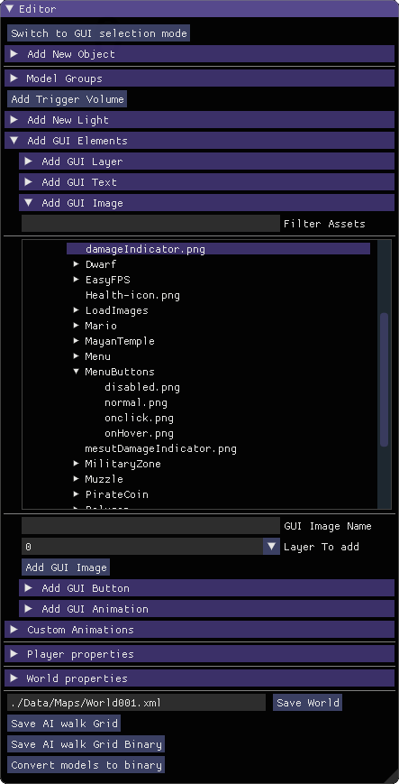

.. _UsingBuiltinEditor:

====================
Using Builtin Editor
====================

Builtin editor can be used to create maps, interfaces and menus. 3D and 2D components share the tooling, and they can be mixed and matched, meaning it is possible to build 3d world as background in menus, or using menus with in game play.

Editor Basics
#############

Editor mode uses a free cursor control scheme. You can move around by "WASD" and look around by moving mouse cursor to edges of the screen. Please take note, editor windows have precedence over these controls, so if mouse is over a control, or if a text input is selected, these controls wont work.

The editor has 3 main windows. By default left of the screen is object properties, right is world properties and bottom is animation sequencer. As expected you can drag and drop and resize the windows. If no object is selected, only the world properties window is visible. Animation sequencer is visible only when creating an animation.

World Editor Details
####################

World editor loads up with almost all the features hidden by the titles. The fresh loaded window looks like this:

.. figure:: _static/media/images/editor-world-nonSelected.png
    :align: center

There are 2 main types of elements that can be used to build the world.

* 3D Objects
* Lights
* GUI elements

To make selection easier, click to select doesn't work for both types at the same time. At launch you can select Objects. If you click "Switch to GUI selection mode", you will be able to select GUI elements, but not Objects. The button will be replaced by "Switch to World selection mode".

Adding 3D objects
_________________

There are 2 types of 3D object you can add to the world.

* Models
* Trigger volumes

It is also possible to create a ModelGroup.

.. figure:: _static/media/images/WorldEditor/addObjectSelected.png
    :align: center

A directory tree of ./Data folder will be loaded, with directories that don't contain model files filtered out. For filtering based on  file name, the text box just above can be used.
When mass is set to 0, the object will be marked "static" by physics system. This means the model will not be able to move, outside of the editor. It is the default setting, to be used for building the world. Any other value will mark the object as "dynamic", meaning the objects movements will be governed by physics engine.

If an object is already selected, "Copy position offsets" settings and "Copy Selected Objects" button is shown. These are used to copy selected object, with given offsets. Offsets can be used to make copy automatically position so a grid or a wall can be easily created.

    Dynamic object have Convex hulls (left), while static objects have full mesh as collision mesh (right).

    Static objects can use baked collision meshes(right)

    animated object has per bone convex hulls

Dynamic objects physical representations are simplified automatically. For inanimate models, the simplified representation will be a convex hull. This means the cavities, crannies etc. will not be calculated for them. For animated models, each vertex will be assigned the bone that has the most weight on it, and for each bone a convex hull will be created. It means separate members of the model will be calculates as such.

Static object have a full mesh representing physical object. It is possible to replace this with a simplified mesh. To do so, bake meshes with names prefixed with \"UCX_\". They will be used for physics.

.. note::
    Models with animations, both from the asset itself and custom using the editor are considered "kinematic" It means the object is allowed to move, but the movement is not governed by physics engine. Those types of objects can't be moved by physical interactions like pushing or pulling, but they can effect physical objects.

.. note::
    Because physical representation is dependent on the mass, mass setting cant be changed once an model is added to the world. If you need to change the mass, remove and add again.

Add Trigger Volume button will create an empty cube. That cube can be used to trigger custom code paths. The details are at :ref:`Trigger Object Editor`.

Creating ModelGroups
____________________

A model group can hold unlimited number of models, or other model groups. It is used to make operations on multiple objects easier. First part of Model Groups section is used to put a model to a model group. Second part is used to create a new model group with given name.

Adding Lights
_____________

Limon Engine uses a custom forward renderer with full dynamic light calculation. Since these calculations are resource hungry, only 4 lights will be enabled at any given time. This value is set at compile time, and not expected to be changed by game developers.
To make usage easier, only 1 directional light is allowed, but that light is never disabled (assumed Moon/Sun), so 1 directional + 3 point, or 4 point lights may be active at any given time. Engine itself decides which ones to activate and deactivate using player position, so adding more than 4 light is allowed.

Adding GUI Elements
___________________

GUI elements are rendered using layers. Each layer has a level, with default layer at level 0. Bigger levels are higher up, meaning when overlapped, the one with the higher level will be rendered.

You can add the following using the editor:

* Layer
* Text
* Image
* Button
* Animation

**GUI Layer**

Add GUI layer menu allows you to add a new layer, with set level.

**GUI Text**

To add GUI text, you need to set the font, font size and name. The layer of the text can be selected from the drop down.

.. note::
    Text scaling will be converted to font size on next load, to provide better quality

**GUI Image**

When adding Image as GUI element, a directory tree of ./Data will be shown, filtered based on supported image formats. To filter based on file names, the fiter text box on top of directory listing can be used. The layer of the image can be selected from the drop down.

**GUI Button**

To add GUI Button, you need to set the name, and set normal image using directory tree. The rest of the fields are optional. For details please check :ref:`GUI Button Settings`.
The layer of the button can be selected from the drop down.

**GUI Animation**

This Widget is not fully functional at 0.6 release. Please avoid until next release.

Player Properties
_________________

The Player properties section allows to set what is the launch time player mode. For game release, this should be either Menu, or Physical. Other types can be useful for development.

* Physical: Normal Player for game play
* Debug: The player that controls exactly like physical, but doesn't interact with physics, so can fly and walkthrough objects. Also renders physics meshes, GUI borders and AI walk grid to allow debugging issues.
* Editor: Builtin editor.
* Menu: Menu interaction is allowed, movement and screen rotation disallowed. Mouse is set to free movement.

If a custom player extension is going to be used, entering its name will load and enable the extension. If player has a Model attached, there will be an "Disconnect Attachment" button.

Setting Up World Properties
___________________________

The world properties is used to set map global properties.

**OnLoad Actions**

If map designer wants to launch some custom action at map load, this interface can be used to set as many as required. Details of them are at :ref:`Triggers`

**Music**

Music of the map can be set using the directory listing

**SkyBox**

Setting skybox is two step process. First directory that contains the images is set, then 6 image that form up the skybox will be selected.

**Loading Image**

A loading image can be set using the loading image directory listing. If no image is set, an empty screen will be shown.

**ESC Handling**

This setting allows customising the behaviour of ESC key.

* Quit Game: exits the game immediately without asking for a verification
* Return Previous: Loaded maps list is kept within the engine. This option returns the world before current one. If this is the first world, or this world is loaded with force new directive, this option does nothing.
* Load World: This option add a new text input to the editor. The map at the path entered will be loaded if not already, and the current map will switch to the entered one.

Other editor controls
_____________________

Loaded custom animations will be listed under custom animations for convenience. You can load other custom animation by entering the file path.

Saving the map
______________

The map will be saved at the path when save world is clicked, overriding if it already exists.

Limon Auto generates a walking grid for path finding, used by AI Actors. Generating such data takes minutes on big maps, so saving it with map is a must for load speed of a map.
There are 2 types of saving supported for this grid, binary and XML. XML should be avoided by game developers, it is only useful for engine developers. XML format can take up to 2GB of memory. Binary format is the go-to format.

Convert models to binary button scans all the models used in the map, and converts used assets to "*.limonmdel" files. This files use less ram, faster to load and not reversable, making them suitable for game releases. Map itself will be updated to use them if this button is pressed.

.. warning::
    It is worth repeating. The save button overrides if there is a file with same name. Please pay attention.

Object Editor Details
####################

Object editor has two parts. One is the window that is on the left by default, and the other is the gizmos that appear at the position of the object. The window content changes based on the selected object. Each possible object type is documented separately below.

Object editor has tree view of the map, you can use it to change selected object, as well as clicking on them. All object have a remove button at the end of the window, which removes selected object completely.

Model Object Settings
_____________________

    The model window with all options visible

There are 3 radio buttons under the selected object Drop-down. These are "Translate", "Rotate", "Scale". Based on the selected mode, the 6 elements below change, but their usage is the same. First 3 are used for precise settings by dragging, or entering exact value by typing. **To enter typing mode, you should double click the item.** The second 3 items are for setting the values with bigger differences.

Just under these settings, there is snap settings. It is used by gizmo. For details check :ref:`Gizmo Usage`.

If the loaded model contains animations within, these animations are listed under the "Model animation properties", and the speed of this animation can be set using "Animation time scale". If a new animation as part of old one is needed, "Seperate selected animation by time" part can be used. It takes 2 floats as input, and a name. After Create section button is clicked, the animation will be listed just as others.

Limon also supports loading animations from another file, specifically to support Mixamo.com animations. When a model is loaded, Limon checks if there is a "Mixamo" directory at the same path, and if it exists, try to loads the files in that directory as animations for model.

AI properties section has a list of available Actors. Game developers can write custom actors using API provided. Please check :ref:`implementAIActor` for details. If selected actor has settings exposed, they will be listed under actor type drop-down.

.. note::
    If model has no animation, it can't be assigned an AI. Both Animation properties and AI properties will be hidden in that case.

Under AI settings, there is "Step on Sound" setting. This is used as step sound when "Physical player" move on top of the model.

After That there is "Custom animation properties". This section lists currently available animations, you can apply any of the custom animations to any number of models. If you want to create a new custom animation, you can do so by using "Create new" button. This button will open animation sequencer. For details please check :ref:`TriggerVolumes`.

Disconnect from physics button removes the collision mesh from map so the object won't be interacting with physics engine. This can be useful for small probes that should be ignored.

.. _Trigger Object Editor:

Trigger Object Settings
_______________________

The trigger object has same interfaces with model for transformation settings. The difference is at "Trigger Properties" section.

This section has 3 Trigger settings.

#. First Enter Trigger.
#. Enter Trigger.
#. Exit Trigger.

The details of Triggers settings are not predefined, triggers can define their own settings. For details, please refer to :ref:`Triggers`. Any or all of the triggers can be left unset.

The logic of triggers is as follows:

#. If player is not detected, and wasn't detected last frame, do nothing.
#. If player is not detected, and was detected last frame, and *Exit Trigger* is set, run it.
#. If player is detected, and was detected last frame, do nothing.
#. If player is detected, and wasn't detected last frame:

    #. If player was not detected ever before, and *First Enter Trigger* is set, run it.
    #. If player was not detected ever before, but *First Enter Trigger* is not set, and *Enter Trigger* is set, run *Enter Trigger*.
    #. If player was detected before, if *Enter Trigger* is set, run *Enter Trigger*.

GUI Text Settings
_________________

GUI Text has custom name that can be updated using the name field. This field doesn't allow spaces of any kind.

The text to render is set using *Text* field.

Position X and Position Y is used for transformation of the text, and Color R G B are the text color.

GUI Image Settings
__________________

GUI Image has custom name that can be updated using the name field. This field doesn't allow spaces of any kind.

The File is the path to image file. Changes on this field is only applied when change image button is clicked.

Full screen click box scales the image to fill the screen, and disables scale and position settings.

Position and Scale are used to set the Transform of the image.

.. _GUI Button Settings:

GUI Button Settings
___________________

GUI Button has custom name that can be updated using the name field. This field doesn't allow spaces of any kind.

There are 4 file settings. Only the Normal file is required, the rest are optional.

The Button can be interactive, depending on the player state. If player is set interactive, the following logic is used:

#. If The button doesn't have an trigger, and have a disabled image set, the disabled image will be shown.
#. If on click image is set, and mouse is down over the button, on click image is shown. Also Trigger will be run. For details, please check :ref:`Triggers`.
#. If on hover image is set, and mouse cursor is over the button, that image will be shown.
#. If all else were wrong, the normal image will be shown.

Position and Scale are used to set the Transform of the button.

Trigger section allows to set the trigger to run when clicked.

Just under these settings, there is snap settings. It is used by gizmo. For details check :ref:`Gizmo Usage`.

.. _Gizmo Usage:

Gizmo Usage
___________

    Gizmo types: Translate, Scale, Rotate

The gizmo is the tool interface that appears at the position of the object that is selected. It has 3 modes, translate(move), scale and rotate. These modes are set using the object editor window, and not all of them are available for all object types. They are directly attached to the editor information, so change in one will update the other.

All three modes use same logic. Dragging an axis applies the transform on that axis. Meaning while in translate mode, clicking on vertical line and dragging will move model vertically. Dragging by the center moves freely, without axis locking. Translate mode also has boxes that can be used to move on a plane, instead of a line.

Some objects have an *snap* setting. This setting is used by the gizmo, to determine step size of the update. Snap of 0.25 in scale mode means dragging the gizmo will scale the object as 1, 1.25, 1.5, 1.75 etc. Same applies for translate and rotate too.

Animation Sequencer Details
###########################

Limon Engine can be used to animate objects or GUI elements using all three transformations. You can select the object you want to animate, and use the custom animation section. If you choose to create a new custom animation, the animation sequencer will be shown.

The sequencer starts with animation name. You can't save/finish an animation without a name. If animated object is a GUI element, translate z component will be used by alpha channel, enabling animating alpha changes.

.. warning::
    If an animation with the same name exists, the old one will be overriden.

.. warning::
    Animations for GUI elements and 3D objects can be used interchangeably, but the results might not be as predicted.

Second line is how many frames long the animation will be. After that the main sequencer part comes. The "-" symbol is used to hide/show the sequences. "+" sign is used to add a section to the end of the animation. Each section has "+" and "-" symbols next to them. "-" removes the section, and "+" add a section just after the selected one, with the same length.

.. note::
    Animations are considered 60 frames per second.

How to create animations
________________________

When sequencer is shown, it will have 1 section. You can imagine the sections, as "What is the final transform, after given time". You can move the object around, scale, rotate as you wish, to set the transform. THe length of the section is time. If you want the animation to have multiple sections, you can press the either "+" button to add another section. When you hit finish, the animation will be saved and applied.

.. note::
    The custom animation is assumed to be built for the selected object, and to run in a loop, starting with map load. If this is wrong, you can remove the animation from the object.

